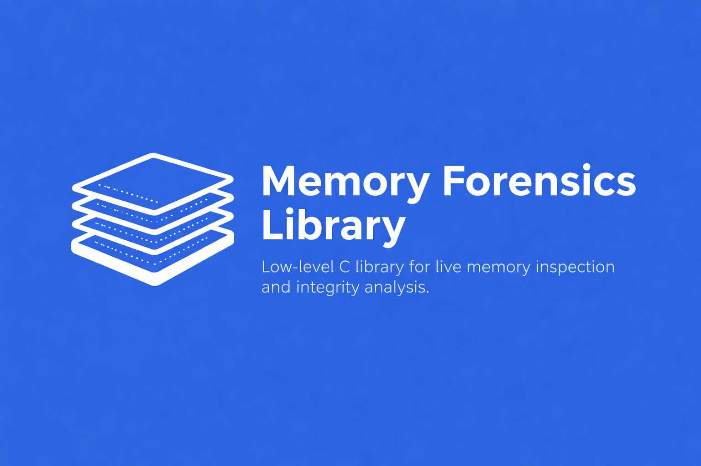

# 🕵️‍♂️ Memory Forensics Library

  

A low-level C library for live process memory inspection and runtime integrity analysis.

## Table of Contents

- [Overview](#overview)
- [Motivation](#motivation)
- [Key Features](#key-features)
- [Architecture](#architecture)
- [Use Cases](#use-cases)

## Overview

**Memory Forensics Library** is a low-level, portable C library designed to inspect and analyze
the memory of running processes in a controlled and ethical manner.

The project focuses on **runtime integrity**, **memory forensics**, and **process inspection**
without relying on network scanning, intrusive hooks, or high-level abstractions.

It is designed for:

- Security engineers
- Researchers
- CI/CD infrastructure
- Educational and forensic analysis

## Motivation

Modern systems increasingly rely on long-running agents and automated pipelines.
However, most integrity validation tools focus on binaries, files, or network behavior.

This library addresses a different problem:

> What is happening inside process memory while the program is running?

The goal is to provide a **clean, auditable, and extensible foundation** for answering that question.

## Key Features

- Live process memory inspection
- Snapshot-based memory forensics
- Memory region modeling (read / write / execute)
- Snapshot diffing for anomaly detection
- Clean OS abstraction layer (backend-driven)
- Designed for CI/CD and automation environments
- No network dependency
- No kernel modules required

## Architecture

The project is built with a **clean layered architecture**:

### Public API
- Opaque handles
- Stable external contract

### Core Engine
- Memory model
- Snapshots
- Diffs
- Process lifecycle management

### OS Backends
- Linux backend (current)
- Windows backend (planned)

The core engine does not depend on OS-specific mechanisms.
All platform-specific logic is isolated behind a backend interface.

## Use Cases

- Runtime integrity validation (e.g. CI/CD agents)
- Detection of memory injection or tampering
- Malware analysis and research
- Security education
- Controlled forensic analysis with authorization
